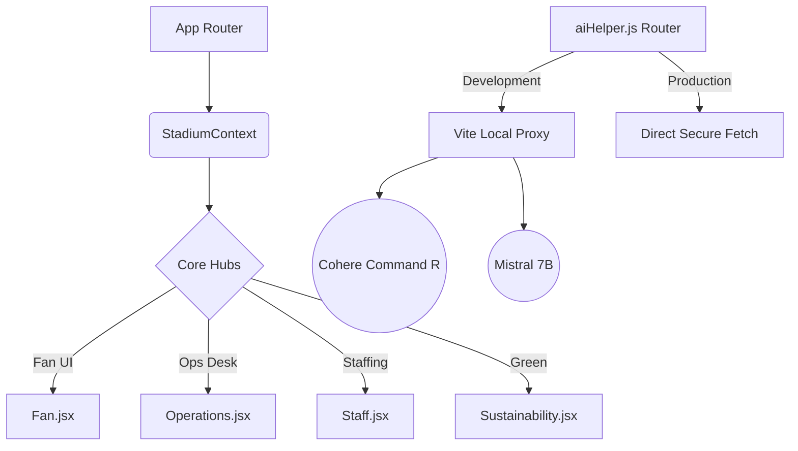

<div align="center">

# 🏟️ StadiumIQ 2026

**The Definitive GenAI-Powered Smart Stadium Operations Platform**

[](https://react.dev)
[](https://vitejs.dev/)
[](https://tailwindcss.com/)
[](https://cohere.com/)
[](https://mistral.ai/)

*A premium, real-time AI co-pilot designed to orchestrate 80,000+ attendees and 10,000+ volunteers across the official FIFA World Cup 2026 venues.*

</div>

---

## 📖 Table of Contents
- [🎯 The Vision](#-the-vision)
- [✨ Core Modules](#-core-modules)
- [🏗️ System Architecture](#-system-architecture)
- [🔌 AI & Data Integrations](#-ai--data-integrations)
- [🛡️ Security & Performance](#️-security--performance)
- [🚦 Getting Started](#-getting-started)
- [🧪 Testing Suite](#-testing-suite)
- [🚀 Deployment](#-deployment)

---

## 🎯 The Vision

Mega-events like the FIFA World Cup present unprecedented logistical challenges. **StadiumIQ** bridges the gap between raw stadium data and actionable intelligence by focusing on the two most critical personas:

| Persona | The Bottleneck | The StadiumIQ Solution |
| :--- | :--- | :--- |
| 🛡️ **Volunteer Commanders** | Managing 10,000+ staff with radio delays and fragmented data | **Volunteer Co-Pilot:** Instant AI incident command, predictive crowd-aware zone maps, and localized staff deployment. |
| 🎫 **Global Fans** | Extreme navigation friction, language barriers, and accessibility gaps | **Fan Experience Hub:** Dynamic crowd-aware wayfinding and a context-aware 5-language AI assistant. |

---

## ✨ Core Modules

### 🧭 1. Volunteer Co-Pilot (Operations Desk)
The nerve center for stadium security and crowd management.
*   **Live KPI Telemetry:** Monitor real-time occupancy rates, unresolved security alerts, and live Air Quality Index (AQI) thresholds.
*   **Tactical Interactive ZoneMap (`<ZoneMap />`):** A responsive SVG map displaying live zone density states (Nominal, Warning, Critical). Volunteers instantly know where crowd crushing is likely to occur.
*   **Predictive Crowd Heatmap:** A custom `Recharts` AreaChart charting historical data and predicting crowd density surges over a 24-hour cycle.
*   **GenAI Tactical Coordinator:** Input an incident (e.g., "Medical emergency at Gate B") and the AI instantly generates a 5-step mitigation protocol, radio deployment instructions, and PA scripts.

### 🎪 2. Fan Experience Hub
A mobile-first interface designed to remove friction for attendees.
*   **Crowd-Aware Wayfinding:** Fans request routes (e.g., "Nearest restrooms") and receive dynamic walking paths that route *around* highly congested concourses.
*   **Polyglot AI Assistant:** Instantly translates and responds to queries in **English, Español, Français, Português, and العربية**. Tone dynamically shifts from conversational (for food queries) to urgent and direct (for medical alerts).
*   **Global Venue Switching:** A universal dropdown instantly shifts the application's context across all 10 official FIFA 2026 venues, recalculating timezones, max capacities, and fetching localized weather.

### 👥 3. Crowd Intelligence & Staffing
*   **Dynamic Roster Table:** A virtualized list of security, medical, and volunteer personnel displaying active zones, status, and historical response times.
*   **AI Pre-Match Briefings:** The AI generates tailored, context-specific briefings for staff based on the specific venue layout, anticipated capacity, and weather conditions.

### 🌱 4. Sustainability Dashboard
*   **Environmental Telemetry:** Pulls live PM2.5, PM10, CO, and NO2 data to assess stadium health against WHO standards.
*   **Composed Energy Analytics:** Dual-Axis `Recharts` comparing solar energy generation versus grid draw, complete with brush-based zoom sliders for micro-analysis.
*   **AI Optimization Engine:** Generates actionable strategies for HVAC scaling and water reclamation based on live capacity and local weather forecasts.

---

## 🏗️ System Architecture

Built on a robust React + Vite foundation, utilizing the Context API for seamless global state management.



### Directory Structure
```text
src/
├── components/          # Reusable, accessible UI components (Navbar, ZoneMap, SettingsModal)
├── context/             # Global State Management (StadiumContext)
├── hooks/               # Custom React hooks (useAI, useLiveData)
├── pages/               # Primary application routes
├── test/                # MSW configurations, Vitest setup, and unit tests
├── utils/               # AI transport layer, sanitization, and API wrappers
├── App.jsx              # Main routing configuration
└── index.css            # Tailwind directives and core CSS variables
```

---

## 🔌 AI & Data Integrations

StadiumIQ operates entirely on client-side requests, utilizing Vite Proxies to eliminate backend overhead while maintaining security.

*   **Generative AI Pipeline:** Seamlessly switches between **Cohere (`command-r-08-2024`)** and **Mistral AI (`open-mistral-7b`, `mistral-small-latest`)** via a unified `useAI` hook. 
*   **CORS Bypass:** In local development, all AI `fetch()` requests are transparently routed through Vite proxies (`/cohere-api` and `/mistral-api`), completely bypassing strict browser CORS policies.
*   **Live Weather & AQI:** Integrates with the free **Open-Meteo API** for live temperature, wind telemetry, and Air Quality Index without requiring authentication.
*   **Solar Telemetry:** Uses the **Sunrise-Sunset.org API** to calculate precise day length and solar noon for sustainability modeling.

---

## 🛡️ Security & Performance

*   **Strict Input Sanitization:** Custom utility functions aggressively strip HTML entities and cap string lengths on all user inputs, preventing Cross-Site Scripting (XSS).
*   **Client-Side Rate Limiting:** Enforces a hard cap of 10 AI API calls per minute per session (persisted via `sessionStorage`) to protect personal API keys from exhaustion.
*   **Network Timeouts:** Utilizes `AbortController` to enforce a strict 10-second timeout on all AI requests.
*   **Graceful Degradation:** If an API endpoint times out, rate-limits, or fails, the application automatically falls back to an offline, realistic Mock Response generation engine, ensuring the UI never crashes.

---

## 🚦 Getting Started

### Prerequisites
*   [Node.js](https://nodejs.org/en/) (v18 or higher)
*   npm (v9 or higher)

### 1. Clone the Repository
```bash
git clone https://github.com/meetchauhan17/Smart-Stadiums-Tournament-Operations.git
cd smart-stadiums-operations
```

### 2. Install Dependencies
```bash
npm install
```

### 3. Start the Development Server
```bash
# Starts Vite with HMR and active CORS proxies
npm run dev
```

---

## 🧪 Testing Suite

StadiumIQ boasts a rigorous test suite powered by **Vitest** and **MSW (Mock Service Worker)** to intercept and mock complex AI network requests deterministically.

```bash
# Run the complete test suite
npm run test

# Run tests in continuous watch mode
npm run test:watch

# Generate a comprehensive V8 coverage report
npm run test:coverage
```

---

## 🚀 Deployment

The project is highly optimized for Edge deployments on **Vercel** or **Netlify**.

1.  **Build Command:** `npm run build`
2.  **Output Directory:** `dist`
3.  **API Keys:** Because this is a client-heavy architecture, users securely input their Cohere or Mistral API keys directly into the app's Settings Modal. Keys are stored safely in the browser's `localStorage` — no server-side `.env` configuration is strictly necessary to host the UI!

---
<div align="center">
  <i>Engineered for the GenAI FIFA World Cup Hackathon 2026.</i>
</div>
