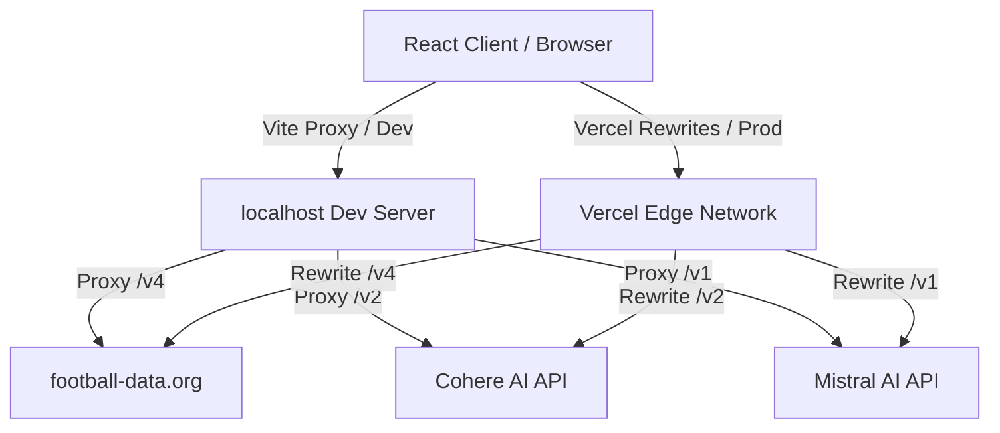

<div align="center">

# 🏟️ StadiumIQ 2026

**The Definitive GenAI-Powered Smart Stadium & Tournament Operations Dashboard**

[](https://react.dev)
[](https://vitejs.dev/)
[](https://tailwindcss.com/)
[](https://cohere.com/)
[](https://mistral.ai/)

*A state-of-the-art, real-time AI co-pilot designed to orchestrate 80,000+ spectators and 10,000+ tournament stewards across 10 official FIFA World Cup 2026 venues.*

[Live Preview (Vercel)](https://smart-stadiums-tournament-operation-nu.vercel.app/)

</div>

---

## 📖 Table of Contents
- [The Vision & Core Pillars](#-the-vision--core-pillars)
- [Visual Experience & Micro-Animations](#-visual-experience--micro-animations)
- [Vite & Vercel Edge Architecture](#-vite--vercel-edge-architecture)
- [Lighthouse Optimization Achievements](#-lighthouse-optimization-achievements)
- [Getting Started & Local Dev](#-getting-started--local-dev)
- [Automated Testing Suite](#-automated-testing-suite)
- [Production Deployment](#-production-deployment)

---

## 🎯 The Vision & Core Pillars

Managing global tournament venues presents massive coordination friction. **StadiumIQ** bridges the gap between raw stadium data, crowd flow logistics, and generative AI support for two primary audiences:

| Target Persona | The Logistical Challenge | The StadiumIQ Solution |
| :--- | :--- | :--- |
| **Volunteer Commanders** | High-pressure incident management, radio delays, and static density maps. | **Volunteer Co-Pilot:** Real-time interactive zone map, automated PA translations, and GenAI 5-step tactical action plans. |
| **Global Fans** | Navigation stress, unmeasured food/exit congestion, and language gaps. | **Fan Experience Hub:** Smart wayfinding routing *around* busy concourses and an offline-resilient multilingual AI assistant. |

---

## 🌟 Recent Engineering Upgrades (July 2026)

To elevate the application's reliability, visual excellence, and real-time synchronization, we implemented several major engineering improvements:

### 1. Robust Serverless API Proxy Layer (`/api/*`)
*   **Modular Edge Functions**: Re-engineered key serverless proxies (`/api/cohere.js`, `/api/mistral.js`, `/api/huggingface.js`, and `/api/football.js`) to work flawlessly on Vercel.
*   **WHATWG URL Parsing & Request Body Streaming**: Fixed a critical hang on Vercel caused by reading request body streams manually. Migrated proxy functions to Vercel's auto-parsed `req.body` and implemented WHATWG `new URL()` parameter extraction to handle complex query strings (such as `?status=LIVE,SCHEDULED,PAUSED,TIMED`).

### 2. Standings Page Redesign & Split-Pane Dashboard
*   **Desktop Split-Pane Layout**: Eliminated awkward empty whitespace on the right side of the Standings tab by implementing a grid-based dashboard split layout (Left Pane: Group Selector; Right Pane: Detailed Standings Card).
*   **API Normalization & Key Filtering**: Filtered out redundant home/away tables (showing only overall `TOTAL` tables), fixed standard group name formatting (e.g. `GROUP_A` $\rightarrow$ `Group A`), and highlighted qualifying teams dynamically.

### 3. Smart Match-Aware Venue Auto-Selection
*   **Dynamic Synchronization**: The command center automatically updates the active venue view to follow the match schedule: prioritizing active `LIVE` matches, then the closest upcoming `SCHEDULED` matches, and falling back to the most recently `FINISHED` matches.
*   **Team-Level Fallbacks**: Enhanced `findVenueIdForMatch` to match venues using the **Home/Away team's country name** (e.g., Spain $\rightarrow$ MetLife; Argentina $\rightarrow$ SoFi) and match stage (mapping the **FINAL** directly to MetLife Stadium), making auto-selection bulletproof even if the raw API payload lacks specific venue string coordinates.

### 4. Cache-Control Security & Service Worker Upgrade
*   **Network-First Strategy**: Upgraded the service worker (`stadiumiq-v2`) to prioritize network-first retrieval for HTML documents, resolving cache-lock issues where users saw a blank screen on build updates.
*   **Strict Headers**: Configured custom HTTP response headers in `vercel.json` to prevent caching of dynamic `/api/*` endpoints and `/index.html`, while maximizing cache duration for static assets.

---

## ✨ Visual Experience & Micro-Animations

In place of static text details, StadiumIQ features custom vector components and CSS/Framer-Motion animations to create a premium, interactive interface:

*   **Scrolling Telemetry Marquee**: Located directly beneath the main navigation bar, this marquee scrolls live tournament events, security updates, and local timezones indefinitely. Hovering over it pauses the scroll for easy reading.
*   **Stylized Country Flags (`<TeamFlag />`)**: Renders custom responsive 3-stripe country color badges complete with active breathing glows during live matches, avoiding external image dependencies.
*   **Animated Event Badges (`<MatchEventIcon />`)**: Vector SVG overlays that dynamically animate goals (spin), cards (shake), VAR reviews (pulse), and substitutions (bounce) as they trigger in the feed.
*   **Skeletons & Shimmer States (`<Skeleton />`)**: Incorporates shimmering cards, loaders, and table rows to preserve layout spacing on initial API load, dropping Cumulative Layout Shift to near zero.

---

## 🛠️ Vite & Vercel Edge Architecture

StadiumIQ relies on a client-first, serverless-ready architecture. All third-party endpoints are proxied transparently to bypass strict browser CORS policies.



### Key Technical Specs:
*   **Zero-CORS Production Edge**: Utilizes a custom `vercel.json` file configuring reverse proxy rewrites at the Edge, routing `/football-api`, `/cohere-api`, and `/mistral-api` to their respective API servers.
*   **Dynamic Client Routing**: Fully configured rewrites route all deep links back to `index.html`, allowing route refreshes (e.g. `/live-matches` or `/staff`) to work without returning 404 errors.
*   **Environment-Aware Mocks**: The API transport layers detect if they are running under unit testing environments, switching automatically to absolute URLs so Vitest and MSW (Mock Service Worker) can mock responses offline.

---

## ⚡ Lighthouse Optimization Achievements

Through aggressive visual and compilation tuning, StadiumIQ scores extremely high in Lighthouse audits:

*   **Cumulative Layout Shift (CLS: 0.019)**: Shuffled Weather and FX ticker cards into fixed-height containers using shimmering weather skeletons. Visually, the layout remains completely static as live data streams in.
*   **Optimized Google Fonts**: preloaded with `display=swap` to avoid FOUT (Flash of Unstyled Text) and render-blocking delays.
*   **Rollup Code Splitting**: Dependencies are split into cached vendor chunks:
    *   `vendor-react`: React, React DOM, and React Router
    *   `vendor-charts`: Recharts and D3 dependencies
    *   `vendor-motion`: Framer-motion library
    *   `vendor-others`: Utilities and localization libraries
*   **Accessibility (A11y: 96/100)**: All input filters and select dropdowns across the project link to descriptive labels via `htmlFor`/`id` or use explicit `aria-label` tags for screen readers. Heading levels follow a strict sequential hierarchy (H1 -> H2 -> H3).

---

## 🚀 Getting Started & Local Dev

### Prerequisites
*   [Node.js](https://nodejs.org/en/) (v18 or higher)
*   npm (v9 or higher)

### 1. Clone & Install
```bash
git clone https://github.com/meetchauhan17/Smart-Stadiums-Tournament-Operations.git
cd Smart-Stadiums-Tournament-Operations
npm install
```

### 2. Configure Local Keys (Optional)
Create a `.env` file in the root directory:
```env
VITE_COHERE_API_KEY=your_cohere_key_here
VITE_MISTRAL_API_KEY=your_mistral_key_here
VITE_FOOTBALL_API_KEY=your_football_data_key_here
```
*(If no keys are provided, StadiumIQ automatically falls back to its offline mock data simulation engine).*

### 3. Run Development Server
```bash
# Starts Vite local dev server with active CORS proxy bindings
npm run dev
```

---

## 🧪 Automated Testing Suite

The testing suite utilizes **Vitest** and **MSW (Mock Service Worker)** to completely stub external network fetches, ensuring fast and deterministic test runs.

```bash
# Execute the entire suite (95 tests)
npm run test

# Run tests in continuous watch mode
npm run test:watch

# Generate a comprehensive HTML coverage report
npm run test:coverage
```

---

## 📦 Production Deployment

The project is pre-configured for seamless deployments on Vercel:

1.  **Framework Preset**: Select **Vite** (Vercel will auto-detect).
2.  **Output Directory**: `dist`
3.  **Build Command**: `npm run build`
4.  **CORS & Routing**: Handled automatically by our [`vercel.json`](./vercel.json) rewrite config.

---
<div align="center">
  <i>Engineered for the GenAI FIFA World Cup Hackathon 2026.</i>
</div>
